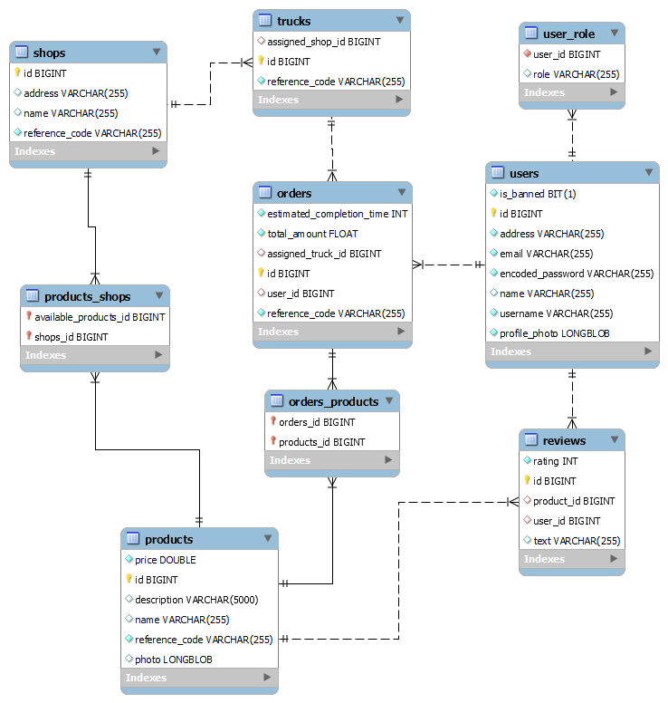

# 2025-Frict

## 📍 Introduction
FRICT (Flexible Real-Time Inventory Control Tool) is a composed system, designed for sales and inventory control both in physical stores and in a company’s online store, which will make the inventory management process easier and more efficient, while processing use-based data to provide more advanced functionalities. In this way, it will include:
- Management and analysis functionalities for administrators and managers
- Registration features for delivery personnel
- Order tracking and product purchasing and rating for users.

Feature sketches:

> ℹ️ NOTE: This software has not been implemented yet. At the moment, only functional and technical objectives will be defined.

&nbsp;

## 🎯 Objectives

### Functional Objectives
In order to provide the main functionality, the application will be able to:
- Log in or register users with different roles, and separate their permissions
- Provide CRUD operations to products, orders, reviews, truck or shops if allowed
- Display highly-precise current or predicted real-time data using charts or graphs
- Notify users about updates related to their orders, reviews or products
- Display approximate delivery truck location using embedded maps
- Capture and process use-generated data to obtain relevant predictions data
- Send email confirmations related to changes in an orders, products, reviews and trucks
- Generate documents using processed data (i.e. product resumes or invoices)
- Provide an automated system that could manage administration tasks when activated

### Technical Objectives
- Spring Boot REST API backend
- JWT-based authentication
- Angular / Tailwind frontend
- MySQL database
- External API integrations
- JUnit / Selenium unit, integration and system tests
- Docker / Docker Compose packaging
- CI / CD using GitHub Actions
- Amazon Web Services (AWS) integrated cloud deployment

&nbsp;

## 📝 Methodology
The application will be implemented following an incremental model with 7 different phases:
- Phase 1: Main features definition, main frontend design and screens navigation flow
- Phase 2: Minimal services, tests and Continuous Integration (CI)
- Phases 3, 4 and 5: Basic, Intermediate and Advanced functionalities implementation
- Phase 6: First Report draft
- Phase 7: Project presentation

### Project schedule
| Phase   | Description                                  | Deadline          | Start Date       | End Date       |
| ------- | -------------------------------------------  | ----------------- | ---------------- | -------------- |
| Phase 1 | Main features, design and screens navigation | 15 September 2025 | 5 July 2025      | 11 August 2025 |
| Phase 2 | Minimal services, tests and CI               | 15 October 2025   | ....             | ....           |
| Phase 3 | v0.1 - Basic functionality, Docker packaging | 15 December 2025  | ....             | ....           |
| Phase 4 | v0.2 - Intermediate functionality            | 1 March 2026      | ....             | ....           |
| Phase 5 | v1.0 - Advanced functionality                | 15 April 2026     | ....             | ....           |
| Phase 6 | First Report Draft                           | 15 May 2026       | ....             | ....           |
| Phase 7 | Project Presentation                         | 15 June 2026      | ....             | ....           |

### Gantt diagram

&nbsp;

## 💻 Functionalities / Features

### Basic functionalities
| Basic funtionality                            | Anon User | Registered User | Store Manager | Delivery driver | Administrator |
| ------------------------------                | --------- | --------------- | ------------- | --------------- | ------------- |
| Modify/Delete profile information             |    | ✅ | ✅ | ✅ | ✅ |
| View product details                          | ✅ | ✅ | ✅ | ✅ | ✅ |
| Add/Delete a product from/to the cart         | ✅ | ✅ |    |    |    |
| Add/Delete a product from/to the wishlist     |    | ✅ |    |    |    |
| Add/Modify/Delete any product from/to a shop  |    |    | ✅ |    | ✅ |
| Make/Cancel a personal order                  |    | ✅ |    |    |    |
| Cancel any associated order                   |    |    | ✅ | ✅ | ✅ |
| Change order status                           |    |    |    | ✅ |    |
| Publish/Delete a personal product review      |    | ✅ |    |    |    |
| Delete any product review                     |    |    |    |    | ✅ |
| Ban/Unban any user                            |    |    |    |    | ✅ |
| Add/Modify/Delete any shop                    |    |    |    |    | ✅ |
| Add/Modify/Delete any delivery truck          |    |    |    |    | ✅ |

### Intermediate functionalities
| Intermediate funtionality                     | Anon User | Registered User | Store Manager | Delivery driver | Administrator |
| ------------------------------                | --------- | --------------- | ------------- | --------------- | ------------- |
| Real-time entities data updates                        | ✅ | ✅ | ✅ | ✅ | ✅ |
| Filter products by its fields                          | ✅ | ✅ | ✅ |  | ✅ |
| Filter products from lowest/highest field              | ✅ | ✅ | ✅ |  | ✅ |
| Receive mail confirmations about relevant info         | ✅ | ✅ | ✅ |  | ✅ |
| Receive in-app notifications about relevant info       | ✅ | ✅ | ✅ | ✅ | ✅ |
| View product recommendations based on user preferences |    | ✅ |    |    |    |
| Download PDF product/order resumes/invoices            |    | ✅ | ✅ | ✅ | ✅ |

### Advanced functionalities
| Advanced funtionality                     | Anon User | Registered User | Store Manager | Delivery driver | Administrator |
| ------------------------------            | --------- | --------------- | ------------- | --------------- | ------------- |
| View associated trucks approximate position in embedded map            |  | ✅ | ✅ | ✅ | ✅ |
| View stored use data displayed in graphs                               |  |  | ✅ |  | ✅ |
| View predicted and statistically-generated data displayed in graphs    |  |  | ✅ |  | ✅ |
| Import/Export Excel charts                                             |  |  | ✅ |  | ✅ |
| Read unique QR code for order reception                                |  |  | ✅ | ✅ |  |
| Generate unique QR code for order reception                            |  | ✅ |  |  |  |

&nbsp;

## 📊 Analysis

### Screens and navigation
> ℹ️ NOTE: Both online shop and management subsystems have login, register and recover password screens in common, so that the user will be redirected to one of the subsystems depending on the permissions level provided.

#### Online shop subsystem
- [All detailed views](/docs/shop-subsystem.md)
- Screen flow diagram:

&nbsp;

#### Management subsystem
- [All detailed views](/docs/management-subsystem.md)
- Screen flow diagram:

&nbsp;

### Entities

### Permissions
In order to separate customers and staff functionalities and to prevent internal data from being accessed by any user, each functionality will only be available to its corresponding user roles, which will be:
- **Anon user**: Lowest level of permissions, restricted to product data read only.
- **Registered user**: Identified user which will be able to order products and track their orders.
- **Store manager**: Used by the person in charge of an specific shop. Allowed to check that shop statistics and products, and restock them if necessary.
- **Delivery driver**: Used by truck drivers to check the content of their assigned orders, and to update its status when delivered.
- **Administrator**: Highest level of permissions, will be able to manage all registered shops, check overall company data and restrict the system access to any registered user if needed.

| Basic funtionality                                   | Anon User | Registered User | Store Manager | Delivery driver | Administrator |
| ------------------------------                       | --------- | --------------- | ------------- | --------------- | ------------- |
| Check product info                                   | ✅ | ✅ | ✅ | ✅ | ✅ |
| Manage orders                                        |  | ✅ | ✅ | ✅ | ✅ |
| Manage products                                      |  |  | ✅ |  | ✅ |
| Upload images                                        |  | ✅ | ✅ | ✅ | ✅ |
| Manage trucks                                        |  |  | ✅ |  | ✅ |
| Manage shops                                         |  |  |  |  | ✅ |
| Ban/Unban users                                         |  |  |  |  | ✅ |
| Manage reviews                                       |  | ✅ |  |  | ✅ |
| Check basic use-based and predicted product data     | ✅ | ✅ | ✅ | ✅ | ✅ |
| Check advanced use-based and predicted product data  |  |  | ✅ |  | ✅ |

### Images
- `Product`: Multiple images per product
- `Profile`: Single image per profile

### Charts
- Weekly benefits: line chart
- Sells per shop: bar chart
- Assigned orders per truck: pie chart

### Complementary technologies
- **JS2PDF**: Receipts/Invoices generation
- **JavaMail**: Email order confirmations/alerts
- **OpenStreetMap**: Shops and trucks positioning
- **ng2-charts**: Data charts

### Advanced algorithm/query
- Real-time truck positioning
- Real-time data processing and updating in order to obtain precise predictions
- Product filtering and recommendations based on user´s interests

&nbsp;

## 📈 Progress tracking

- Project Blog on Medium: [Medium Blog](https://medium.com/@mjpulido03/list/frict-527a48059e82)
- GitHub Project Board: [GitHub Project](https://github.com/orgs/codeurjc-students/projects/15)

&nbsp;

## 🎓 Author

This application will be developed as part of the **Bachelor’s Final Projects (TFGs)** for both **Computer Science** and **Software Engineering** Bachelor Degrees, at **Superior Technical School of Computer Science (ETSII) - King Juan Carlos University (URJC)**.

- **Student**: Marcos Jiménez Pulido
- **Professor**: Óscar Soto Sánchez

&nbsp;

## 📄 License

This project is under Apache 2.0 license. See the [`LICENSE`](./LICENSE) file for details.
