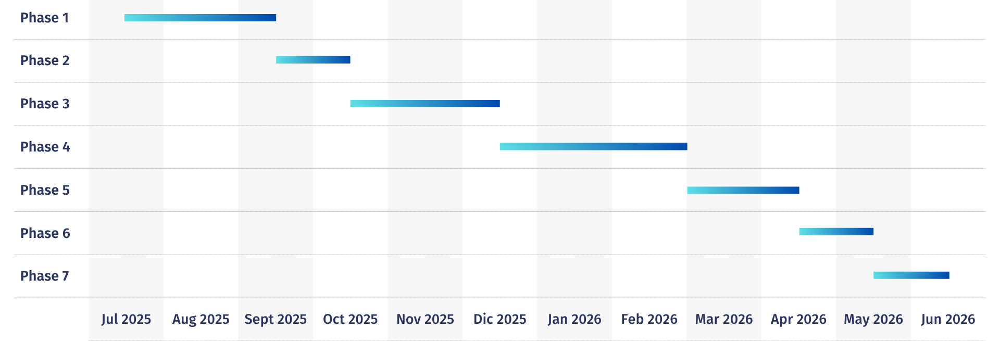

## 📝 Methodology
The application will be implemented following an incremental model with 7 different phases:
- Phase 1: Main features definition, main frontend design and screens navigation flow
- Phase 2: Minimal services, tests and Continuous Integration (CI)
- Phases 3, 4 and 5: Basic, Intermediate and Advanced functionalities implementation
- Phase 6: First Report draft
- Phase 7: Project presentation

### Project schedule
| Phase   | Description                                  | Deadline          | Start Date       | End Date       |
| ------- | -------------------------------------------  | ----------------- | ---------------- | -------------- |
| Phase 1 | Main features, design and screens navigation | 15 September 2025 | 5 July 2025      | 11 August 2025 |
| Phase 2 | Minimal services, tests and CI               | 15 October 2025   | ....             | ....           |
| Phase 3 | v0.1 - Basic functionality, Docker packaging | 15 December 2025  | ....             | ....           |
| Phase 4 | v0.2 - Intermediate functionality            | 1 March 2026      | ....             | ....           |
| Phase 5 | v1.0 - Advanced functionality                | 15 April 2026     | ....             | ....           |
| Phase 6 | First Report Draft                           | 15 May 2026       | ....             | ....           |
| Phase 7 | Project Presentation                         | 15 June 2026      | ....             | ....           |

### Gantt diagram

&nbsp;

[◀️](/docs/pages/01-objectives.md) **Page 2. Methodology** [▶️](/docs/pages/03-functionalities.md)

[⏪ Return to Index](/README.md)
