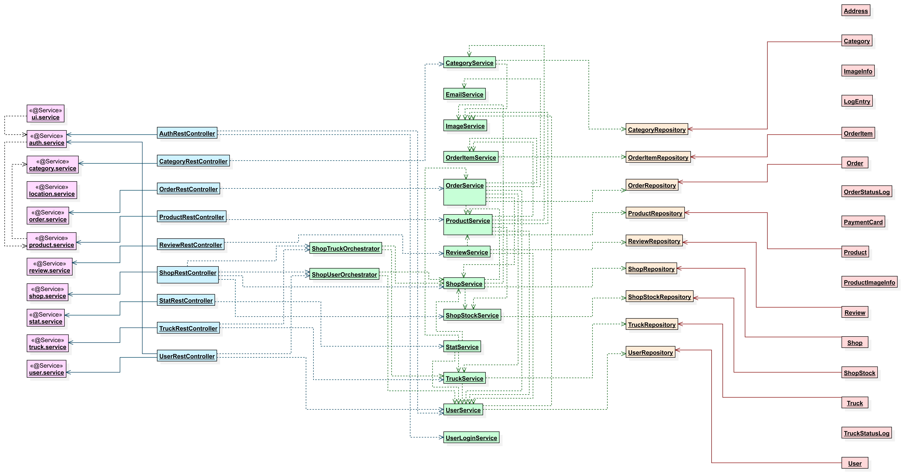
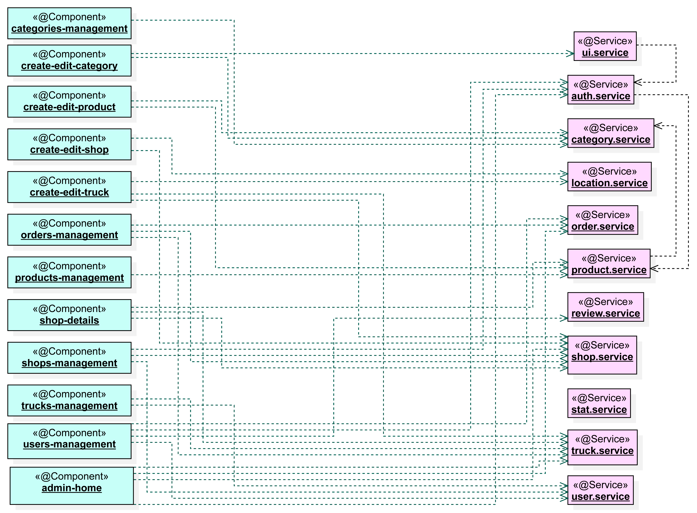
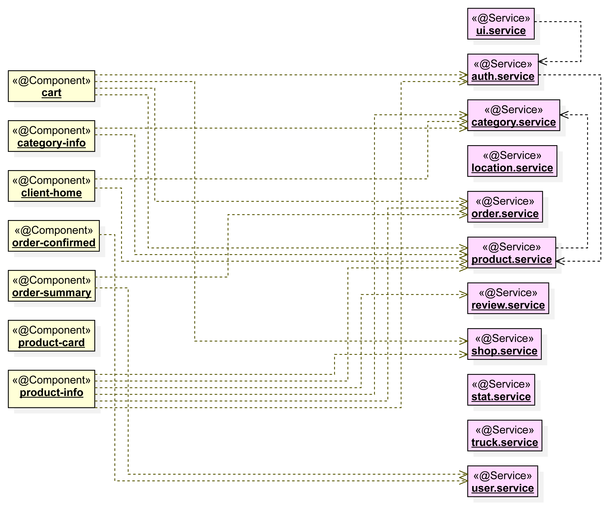
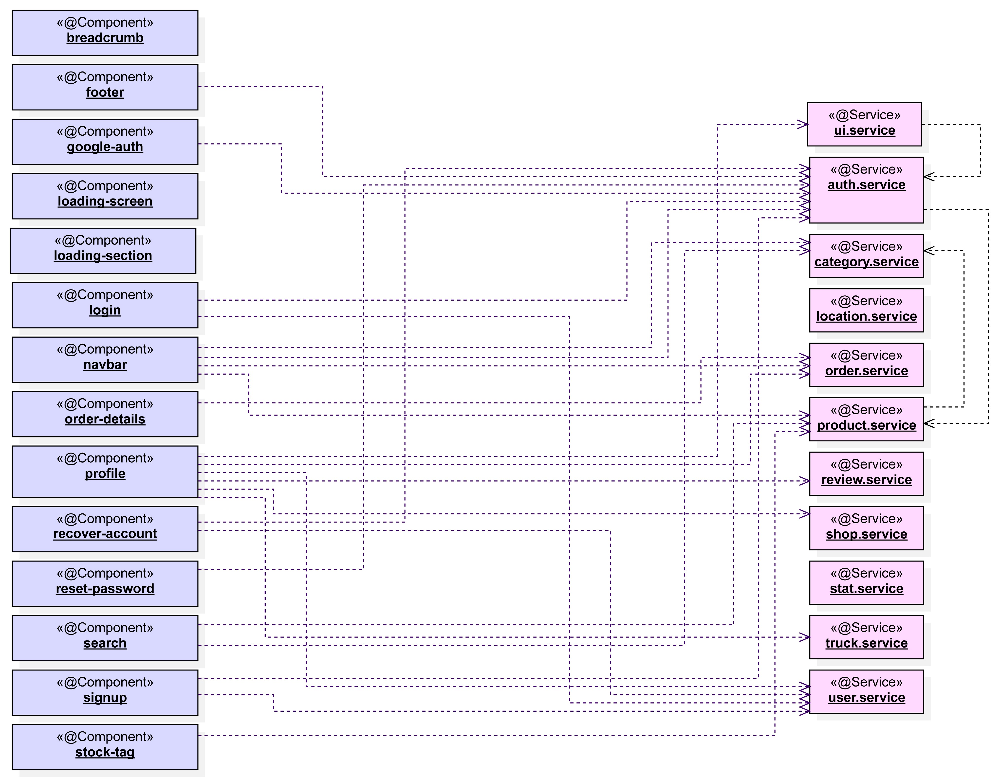

## 📡 Development guide

### 🔎 Index

1. [Introduction](#-introduction)
2. [Technologies Stack](#-technologies-stack)
3. [Tools](#-tools)
4. [Architecture](#-architecture)
5. [Quality Assurance](#-quality-assurance)
6. [Development Process](#-development-process)
7. [Code Environment and Execution](#-code-environment-and-execution)

&nbsp;


### 📍 Introduction

This website follows a Single-Page Application (SPA) architecture, where the user interface is dynamically updated by combining different independent components rather than loading entire new pages. This ensures a faster, smoother, and more fluid user experience during each interaction.

The system is built upon a strictly decoupled Client-Server model, ensuring high scalability and maintainability by reducing dependencies. The core architecture relies on the following components:

* **Client (Frontend):** An Angular-based SPA that communicates with the server via REST API requests to fetch and render dynamic content.
* **Server (Backend):** A robust Spring Boot application managing the REST API. It strictly adheres to the **Model-View-Controller (MVC)** architecture, keeping controllers completely isolated from any business logic. Furthermore, it implements the **Facade design pattern** through Orchestrators to efficiently manage complex, multi-service transactions.
* **Database:** A relational MySQL database with a dynamic schema managed automatically via Spring Data JPA entities and annotations.
* **Object Storage:** MinIO, an AWS S3-compatible storage server, dedicated to handling and serving multimedia assets (such as user and product images) efficiently.

To ensure data protection and safe access, the system utilizes **Spring Security** integrated with **JWT (JSON Web Tokens)** for internal session management and **OAuth2** for third-party authentication. Additionally, the API is built with production readiness in mind: it is fully documented using **Swagger (OpenAPI)** to ensure the documentation is always synchronized with the codebase, and relies on **Spring Boot Actuator** to provide real-time health checks and system monitoring.

| Feature | Technologies & Patterns |
| :--- | :--- |
| **Architecture & Patterns** | SPA, Strict MVC, Facade Pattern (Service Orchestrators). |
| **Backend Technologies** | Java, Spring Boot, Spring Security (JWT & OAuth2), Spring Data JPA, Lombok. |
| **Frontend Technologies** | Angular 19 (Standalone Components, Signals), TypeScript, HTML, Tailwind CSS. |
| **API & Monitoring** | Swagger (OpenAPI), Spring Boot Actuator. |
| **Data & Storage** | MySQL, MinIO (S3-compatible Object Storage). |
| **Testing & QA** | JUnit, Mockito, REST Assured, Jasmine, Selenium, JaCoCo, SonarQube Cloud. |
| **Tools & IDEs** | IntelliJ IDEA, MySQL Workbench, Git. |
| **Deployment** | Docker Compose, Amazon Web Services (AWS). |
| **Development Process** | Feature branches, Pull Requests, GitHub Actions (Strict CI validation). |

&nbsp;


### 📋 Technologies Stack

#### 💾 Backend

- [**Spring Boot**](https://spring.io/projects/spring-boot): Facilitates the creation and execution of REST services by reducing initial configuration and providing a ready-to-use productive environment.
- [**Spring Data JPA**](https://spring.io/projects/spring-data): Simplifies database access and management through repositories and automatic queries, streamlining relational data persistence.
- [**Spring Security**](https://spring.io/projects/spring-security): Handles authentication and authorization using JWT for internal sessions and OAuth2 for external integrations, ensuring endpoints are strictly protected.
- [**Java**](https://www.java.com/en/): Used as the main programming language, offers a robust object-oriented structure and high performance.
- [**Maven**](https://maven.apache.org/): Simplifies project building, packaging, testing, and dependency management.
- [**Lombok**](https://projectlombok.org/): Reduces boilerplate Java code (such as getters, setters, and constructors) through annotations, keeping the backend codebase clean and maintainable.
- [**Swagger (OpenAPI)**](https://swagger.io/): Automatically generates interactive and up-to-date API documentation directly from the codebase.
- [**Spring Boot Actuator**](https://docs.spring.io/spring-boot/docs/current/reference/html/actuator.html): Provides built-in endpoints for real-time application monitoring and health checks.
- [**MySQL**](https://www.mysql.com/): Relational database engine that provides reliable data persistence and dynamic schema management.
- [**MinIO**](https://min.io/): High-performance, S3-compatible object storage server used for efficiently handling and serving multimedia assets.
- [**JWT (JSON Web Token)**](https://www.jwt.io/introduction#what-is-json-web-token): Provides stateless authentication, a secure method for transferring information between the Angular client and the Spring Boot server through digitally signed tokens.

#### 📺 Frontend

- [**Angular**](https://angular.dev/): Manages the user interface and client-side logic. Utilizes modern features such as Standalone Components and Signals to deliver a highly reactive, optimized, and seamless SPA experience.
- [**TypeScript**](https://www.typescriptlang.org/): Provides strict type safety and powerful tooling support, preventing runtime errors and drastically improving frontend maintainability.
- [**Tailwind CSS**](https://tailwindcss.com/): A utility-first CSS framework used for rapid UI development and highly customizable styling.
- [**JSON**](https://www.json.org/): Serves as the standard, lightweight format for exchanging data between the Angular client and the Spring Boot server.

#### 🧪 Testing & QA

- [**JUnit**](https://junit.org/) & [**Mockito**](https://site.mockito.org/): Core frameworks used for implementing isolated unit and integration tests.
- [**REST Assured**](https://rest-assured.io/): Specifically utilized to automate and validate the behavior of the REST API endpoints.
- [**Jasmine**](https://jasmine.github.io/): Behavior-driven development framework used to execute robust client-side tests for the Angular application.
- [**Selenium**](https://www.selenium.dev/): Automates web browsers to execute comprehensive End-to-End (E2E) testing.
- [**JaCoCo**](https://www.jacoco.org/) & [**SonarQube Cloud**](https://sonarcloud.io/): Provide detailed code coverage and continuous static code analysis to maintain high-quality standards.

#### 🚀 DevOps

- [**Docker**](https://www.docker.com/): Packages the application into isolated containers, ensuring consistent execution.
- [**Docker Compose**](https://docs.docker.com/compose/): Orchestrates multiple containers, allowing easy setup of the full application stack.
- [**GitHub Actions**](https://github.com/features/actions): Automates CI/CD workflows, enforcing strict Pull Request validation.
- [**Amazon Web Services (AWS)**](https://aws.amazon.com/): Cloud computing platform used for the robust and scalable deployment of the final application.

&nbsp;


### 🔧 Tools

- [**IntelliJ IDEA**](https://www.jetbrains.com/idea/): Powerful IDE for backend development and deep integration with the Spring ecosystem.
- [**MySQL Workbench**](https://www.mysql.com/products/workbench/): Facilitates database design and visual modeling for managing the MySQL schema.
- [**Git**](https://git-scm.com/): Enables strict version control and collaboration across the development lifecycle.

&nbsp;


### 🏢 Architecture

The application's architecture is designed for high scalability and clear separation of concerns, following a modular approach across all its layers.

#### 🏛️ Domain Model

The foundation of the system is built upon a well-defined relational model and a modular package structure that isolates core functionalities into specific business domains.

* **Database Schema:** A relational structure is used to handle complex relationships between entities.


* **Package Diagram:** Depending on their responsibilities, all entities can be sorted in different packages.


#### 📡 REST API & Documentation

Communication between the frontend client and the backend server is handled entirely via a standardized RESTful API, utilizing Angular proxies to enable relative routing on the client side.

The API strictly adheres to the **OpenAPI** (Swagger) specification, which serves as a comprehensive and interactive contract for the system's endpoints. This standardization ensures that frontend components and external consumers have a reliable, self-documenting interface to interact with. Once the Docker stack is operational (Check [**Execution**](/docs/pages/03-execution.md) section), developers can dynamically explore, test, and validate API requests in real-time through the built-in **Swagger UI** accessible at `https://localhost/swagger-ui/index.html`.

> ℹ️ **NOTE:** For quick reference without needing to spin up the application environment, a static HTML-rendered version of the API documentation is readily available [here](../openapi.json).

#### ⚙️ Server-Side Architecture (Backend)

The backend is built with **Spring Boot**, implementing a robust multi-layered MVC architecture. This design guarantees a strict separation of concerns, isolating core business logic from HTTP request handling and database interactions. The architecture is broadly divided into:

* **API Layer:** REST controllers that act as the entry points, receiving and delegating HTTP requests.
* **Business Layer:** A combination of services and orchestrators (implementing the Facade Pattern to manage circular references) that manage core business rules, service communication, and complex transactional integrity.
* **Data Access Layer:** Utilizes the Repository Pattern (via Spring Data JPA) to abstract database operations and map them directly to the domain entities.



#### 💻 Client-Side Architecture (Frontend)

The frontend is a modern **Angular** application built with Standalone Components to maximize code reusability, maintainability, and performance. Rather than detailing individual views, the architecture is logically structured into high-level functional areas that consume centralized API services:

* **Role-Specific Modules:** Distinct environments tailored to the user's role. This includes dedicated management interfaces for administrators and staff (Admin Module), as well as a streamlined shopping and checkout experience for regular customers (Client Module).
* **Shared Architecture:** A core foundation of common UI elements (navigation, authentication flows, loading states) and centralized services that manage application state and backend communication across the entire platform.

##### Management Components


##### Client Components


##### Common Components



### ☑️ Quality Assurance

To ensure a robust and bug-free environment, the application undergoes a rigorous Quality Assurance (QA) process. A strict Continuous Integration (CI) pipeline enforces these standards, blocking any pull request that does not pass the automated test suite.

#### ⌛ Automated Testing

The platform's reliability is validated through multiple automated testing layers:

- **Unit & Integration Testing:** Powered by **JUnit** and **Mockito**, isolating backend business logic and verifying proper database communication.
- **API Testing:** Using **REST Assured** to validate HTTP responses, JSON payloads, and security constraints.
- **Client-Side Testing:** **Jasmine** is utilized to test the Angular Standalone components and signals logic.
- **End-to-End (E2E) Testing:** **Selenium** automates browser interactions to validate the complete system flow.

#### 📊 Static Code Analysis & Results

Code quality, vulnerabilities, and test coverage are continuously monitored using **SonarQube Cloud** integrated with the **JaCoCo** Maven plugin. Analyzing the initial project scans provides valuable insights into the architecture's health and the current technical debt.

**Overall Project Health:**
As shown in the dashboard below, the project achieves an excellent **Maintainability rating of A**, alongside an exceptionally low code **duplication rate of 0.3%**. The global code **coverage stands at a solid 65.7%**. While the Quality Gate currently flags the Security (E) and Reliability (D) ratings, this is a strictly controlled scenario. The 8 reported security issues are intentional, arising from the hardcoded default passwords and mock credentials required to instantly populate the local seed data upon container startup.


**Risk & Technical Debt Distribution:**
The bubble chart below correlates Technical Debt (X-axis) with Code Coverage (Y-axis). The visual distribution confirms a highly healthy core system: the vast majority of the application's components (represented by the cluster of green bubbles) successfully maintain zero technical debt with varying levels of high test coverage.

The single, prominent outlier — the red bubble indicating over 5 hours of technical debt and near-zero coverage — corresponds exclusively to the `DatabaseInitializer.java` class. Because this class acts solely as a static data injector for local testing environments, it inherently triggers security rules and is intentionally excluded from the standard unit testing scope.


&nbsp;


### 📅 Development Process

The project is being developed using an iterative and incremental process, which follows the Agile principles and applies some of the good coding practices described by XP (Extreme Programming) and Kanban methodologies, such as:
- Code refactoring to achieve improvement
- Simple, incremental and evolutionary changes
- Quality improvement via Continuous Integration


#### ✏️ Task management

In order to keep control of the pending tasks in each iteration, the project will include:

- **GitHub Issues**: Contains the main information about a task, such as its title, description, priority, deadline or even associated branch.
 

- **GitHub Project**: Contains each one of the issues to be completed during the iteration, divided by columns depending on its progress.
  - Columns: _To Do, In Progress, Under Review, Done_.
  - Priorities: _Low, Medium, High, Very High_.
  - Task size: _XS, S, M, L, XL_.

#### 📀 Git Version control

**Main branch**

Remains stable and always available for deployment.


**Branching strategy** 

Each branch contains will enclose the code changes made to implement a single functionality, and will be merged to the main branch once the implementation has concluded and all required tests have been passed successfully.

**Branching process**

1. Create the branch `iteration-feature` from main (e.g. `2-add-minimal-services`)


2. Commit to the branch. After each commit, client and server unit tests will automatically be triggered.


3. Pull request to the main branch after feature implementation is completed. Before merging, client and server unit, integration and system tests will be automatically triggered.

#### 🚧 Continuous Integration (CI)

Project testing and static code analysis is automated by using CI/CD pipelines and GitHub Actions workflows. 

#### Unit Testing On Commit (unit_test_on_commit.yml)

- Runs all **unit tests** with **every commit** made in a feature branch, or manually


- Tests server and client separately to optimize workflow duration


- Does not run any component during the tests

#### Full System Testing On Pull Request (full_test_on_pull_request.yml)

- Runs **before merging a pull request** from a feature branch to the main branch, or manually


- Runs all **unit, integration and e2e tests**


- Backend component is started before integration tests


- Frontend component is started before e2e UI test

#### SonarQube Static Code Analysis (sonar_analysis.yml)

- Runs only manually (due to its complexity and duration)


- Runs all unit, integration and e2e tests


- Backend and frontend components are started before the analysis


- Auxiliar MySQL Docker container is built before the analysis


- JaCoCo coverage tool is used during the analysis, so SonarQube can show coverage metrics

&nbsp;


### 🏁 Code Environment and Execution

#### Initial requirements
In order to be able to run this project, you must have installed:
- Git
- Node.js (includes npm, Node Package Manager)
- Maven for Windows
- Docker
- Angular CLI

#### Command-based execution

1. Open a new terminal window.


2. Download and access the project repository

```
# Install all necessary files
git clone https://github.com/codeurjc-students/2025-2025-Frict.git Frict

# Access the project folder
cd Frict
```

3. Set up the MySQL database

```
# Create a Docker container with a ready-to-use MySQL database and start it
docker run -d --name mysql -e MYSQL_ROOT_PASSWORD=rootpass -e MYSQL_DATABASE=Frict -e MYSQL_USER=appuser -e MYSQL_PASSWORD=apppass -p 3306:3306 mysql:8.0
```
> ℹ️ NOTE: In this case, database credentials are the default ones:
> - Root password: _rootpass_
> - User: _appuser_
> - Password: _apppass_
> 
> This credentials could be modified as desired, considerably increasing database security.

4. Modify `application.properties` file

If you decided to change the database credentials in the previous step, these credentials must be also updated in `application.properties` file within Spring backend. 

```
spring.datasource.username=appuser # Set your custom username
spring.datasource.password=apppass # Set your custom password
```

5. Run the backend component
```
cd backend #Access backend project
mvnw spring-boot:run #Start the Spring application
```

6. Run the frontend component
```
cd frontend #Access frontend project
npm install #Installs all necessary dependencies to run the Angular project
ng serve --proxy-config proxy.conf.json #Starts the Angular project using default proxy
```

7. Open application in browser

Go to https://localhost:4202 in your preferred web browser to access the main page of the application.

#### Running tests
Current tests can be run either for the backend component:
```
cd backend #Access backend project
mvn test #Run all tests
```

Or for the backend component:
```
cd frontend #Access frontend project
ng test --watch=false #Run all tests
```
> ℹ️ NOTE: ProductSystemUITest class requires the frontend component to be up before running its tests for them to be completed successfully. 


#### Using API endpoints
Fully implemented API endpoints are available when backend component is running. Current available endpoints are described below.
```
#Get a product by its id (GET)
https://localhost:443/api/products/1 #Gets information about product with id 1

#Get all available products (GET)
https://localhost:443/api/products/all

#Create a new product (POST)
https://localhost:443/api/products #Creates a product using provided information

#Update an existing product (PUT)
https://localhost:443/api/products/1 #Updates the product with id 1 information using the new data provided

#Delete an existing product (DELETE)
https://localhost:443/api/products/1 #Deletes all the information associated with the product with id 1
```

> ℹ️ NOTE: Product creation and update requires the product data to be provided in the request body. This body should match the following structure:
> 
>{
> 
> "referenceCode": "4A5",
> 
> "name": "Android tablet",
>
> "description": "Entertainment with a bigger screen",
> 
> "price": 130.0
> 
> }

> ℹ️ NOTE: To make this process easier and faster, complete fully-functional endpoints list is available at frict.postman_collection.json file, which could be easily imported by Postman.

&nbsp;

[◀️](/docs/pages/03-execution.md) **Page 4. Development Guide** [▶️](/docs/pages/05-progress-tracking.md)

[⏪ Return to Index](/README.md)