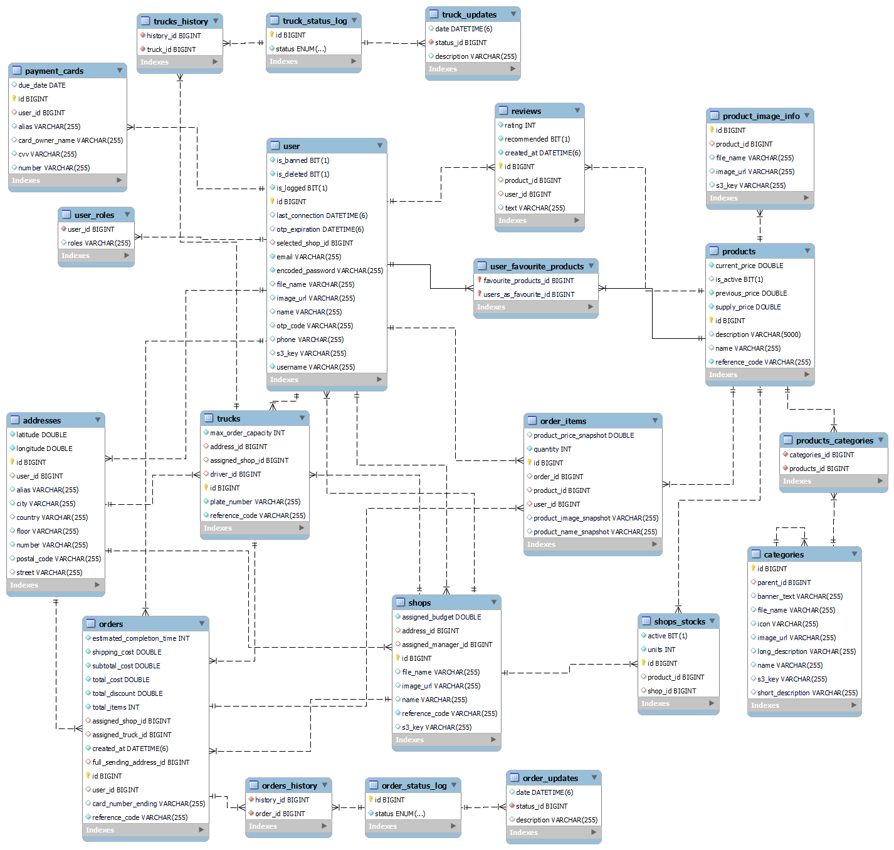
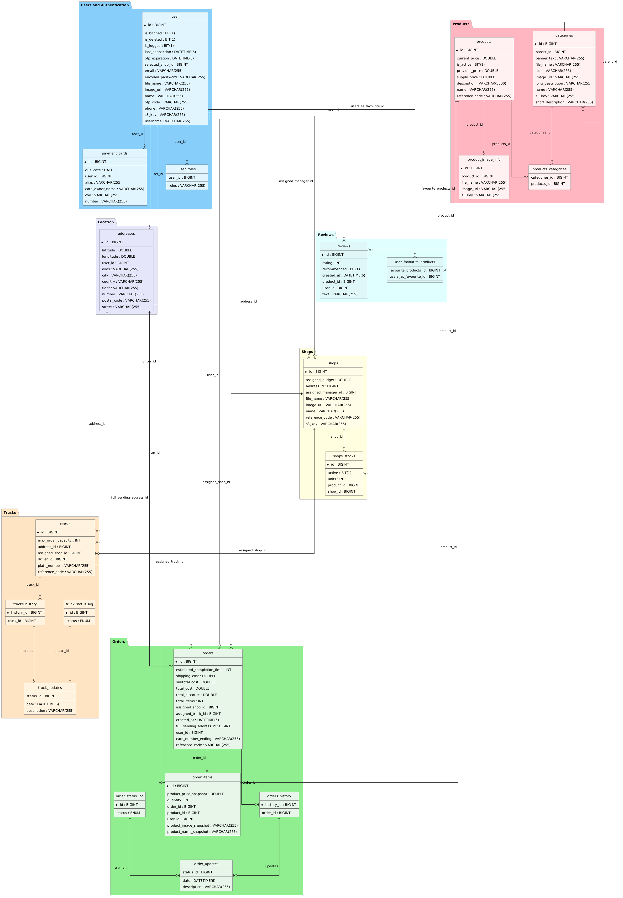
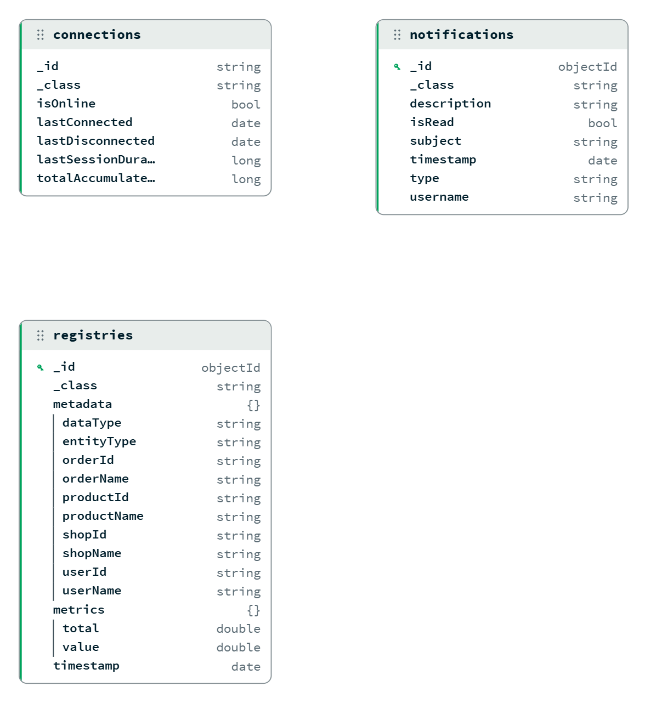
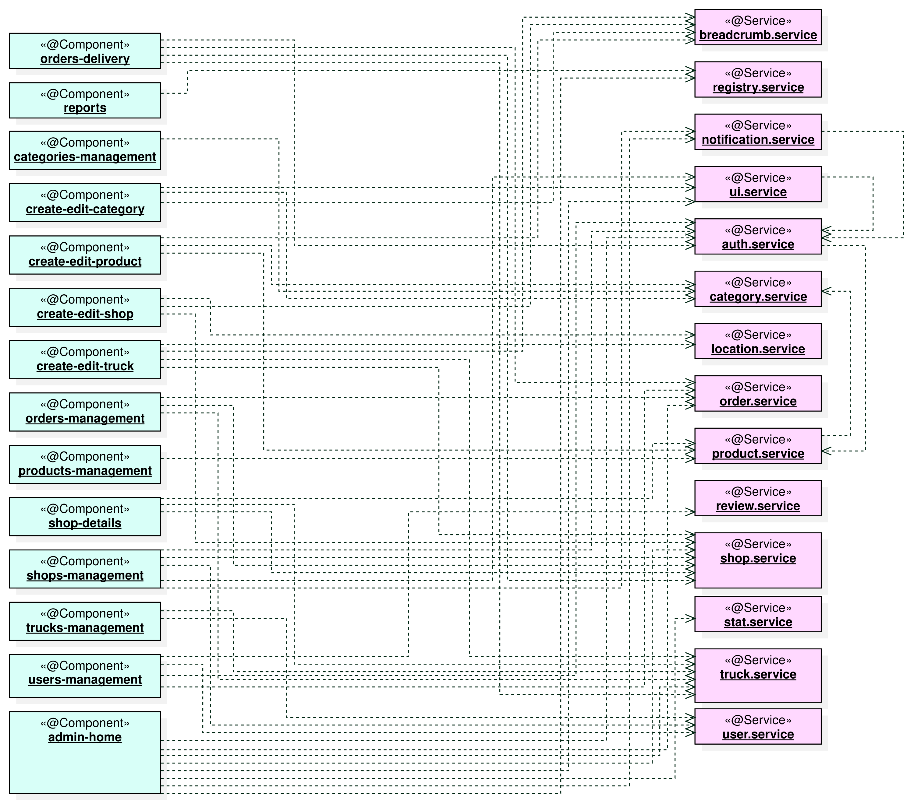
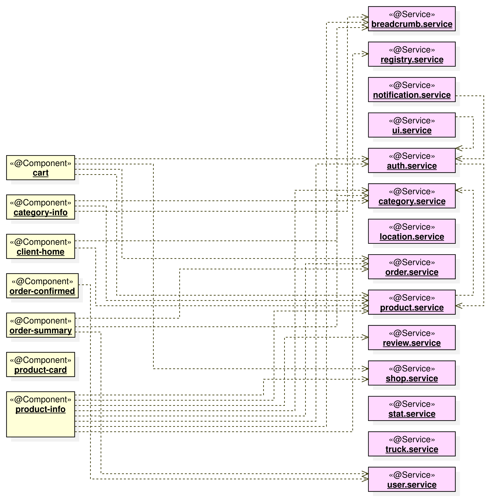
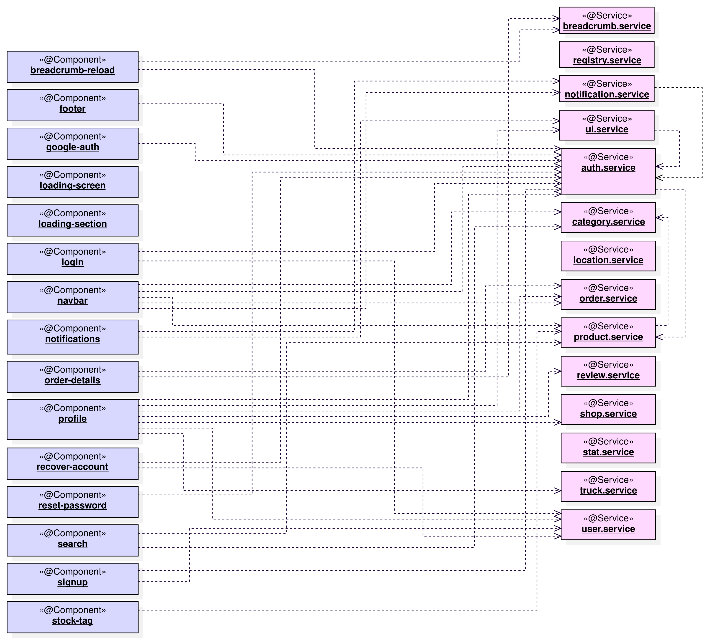

## 🧭 Development guide

### 🔎 Index

1. [Introduction](#-introduction)
2. [Technologies Stack](#-technologies-stack)
3. [Tools](#-tools)
4. [Architecture](#-architecture)
5. [Quality Assurance](#-quality-assurance)
6. [Development Process](#-development-process)
7. [Code Environment and Execution](#-code-environment-and-execution)

&nbsp;


### 📍 Introduction

This website follows a Single-Page Application (SPA) architecture, where the user interface is dynamically updated by combining different independent components rather than loading entire new pages. This ensures a faster, smoother, and more fluid user experience during each interaction.

The system is built upon a strictly decoupled Client-Server model, ensuring high scalability and maintainability by reducing dependencies. The core architecture relies on the following components:

* **Client (Frontend):** An Angular-based SPA that communicates with the server via REST API requests to fetch and render dynamic content.


* **Server (Backend):** A robust Spring Boot application managing the REST API. It strictly adheres to the **Model-View-Controller (MVC)** architecture, keeping controllers completely isolated from any business logic. Furthermore, it implements the **Facade design pattern** through Orchestrators to efficiently manage complex, multi-service transactions.


* **Relational Database:** A MySQL database with a dynamic schema managed automatically via Spring Data JPA entities and annotations.


* **Non-Relational Database:** A MongoDB database with replica set enabled, which enables change streams features for multiple backend instances communications.


* **Object Storage:** MinIO, an AWS S3-compatible storage server, dedicated to handling and serving multimedia assets (such as user and product images) efficiently.


To ensure data protection and safe access, the system utilizes **Spring Security** integrated with **JWT (JSON Web Tokens)** for internal session management and **OAuth2** for third-party authentication. Additionally, the API is built with production readiness in mind: it is fully documented using **Swagger (OpenAPI)** to ensure the documentation is always synchronized with the codebase, and relies on **Spring Boot Actuator** to provide real-time health checks and system monitoring.

| Feature | Technologies & Patterns                                                             |
| :--- |:------------------------------------------------------------------------------------|
| **Architecture & Patterns** | SPA, Strict MVC, Facade Pattern (Service Orchestrators).                            |
| **Backend Technologies** | Java, Spring Boot, Spring Security (JWT & OAuth2), Spring Data JPA, Lombok.         |
| **Frontend Technologies** | Angular 19 (Standalone Components, Signals), TypeScript, HTML, Tailwind CSS.        |
| **API & Monitoring** | Swagger (OpenAPI), Spring Boot Actuator.                                            |
| **Data & Storage** | MySQL, MongoDB, MinIO (S3-compatible Object Storage).                               |
| **Testing & QA** | JUnit, Mockito, REST Assured, Jasmine, Selenium, JaCoCo, Istambul, SonarQube Cloud. |
| **Tools & IDEs** | IntelliJ IDEA, MySQL Workbench, MongoDB Compass, Git.                               |
| **Deployment** | Docker Compose, Amazon Web Services (AWS).                                          |
| **Development Process** | Feature branches, Pull Requests, GitHub Actions (Strict CI validation).             |

&nbsp;


### 📋 Technologies Stack

#### 💾 Backend

- [**Spring Boot**](https://spring.io/projects/spring-boot): Facilitates the creation and execution of REST services by reducing initial configuration and providing a ready-to-use productive environment.


- [**Spring Data JPA**](https://spring.io/projects/spring-data): Simplifies database access and management through repositories and automatic queries, streamlining relational data persistence.


- [**Spring Security**](https://spring.io/projects/spring-security): Handles authentication and authorization using JWT for internal sessions and OAuth2 for external integrations, ensuring endpoints are strictly protected.


- [**Java**](https://www.java.com/en/): Used as the main programming language, offers a robust object-oriented structure and high performance.


- [**Maven**](https://maven.apache.org/): Simplifies project building, packaging, testing, and dependency management.


- [**Lombok**](https://projectlombok.org/): Reduces boilerplate Java code (such as getters, setters, and constructors) through annotations, keeping the backend codebase clean and maintainable.


- [**Spring Boot Actuator**](https://docs.spring.io/spring-boot/docs/current/reference/html/actuator.html): Provides built-in endpoints for real-time application monitoring and health checks.


- [**MySQL**](https://www.mysql.com/): Relational database engine that provides reliable data persistence and dynamic schema management.


- [**MongoDB**](https://www.mongodb.com/): NoSQL document-oriented database that provides high availability, flexible data storage and highly scalable, JSON-like document management.


- [**MinIO**](https://min.io/): High-performance, S3-compatible object storage server used for efficiently handling and serving multimedia assets.


- [**JWT (JSON Web Token)**](https://www.jwt.io/introduction#what-is-json-web-token): Provides stateless authentication, a secure method for transferring information between the Angular client and the Spring Boot server through digitally signed tokens.

&nbsp;

#### 📺 Frontend

- [**Angular**](https://angular.dev/): Manages the user interface and client-side logic. Utilizes modern features such as Standalone Components and Signals to deliver a highly reactive, optimized, and seamless SPA experience.


- [**TypeScript**](https://www.typescriptlang.org/): Provides strict type safety and powerful tooling support, preventing runtime errors and drastically improving frontend maintainability.


- [**Tailwind CSS**](https://tailwindcss.com/): A utility-first CSS framework used for rapid UI development and highly customizable styling.


- [**JSON**](https://www.json.org/): Serves as the standard, lightweight format for exchanging data between the Angular client and the Spring Boot server.

&nbsp;

#### 🧪 Testing & QA

- [**JUnit**](https://junit.org/) & [**Mockito**](https://site.mockito.org/): Core frameworks used for implementing isolated unit and integration tests.


- [**REST Assured**](https://rest-assured.io/): Specifically utilized to automate and validate the behavior of the REST API endpoints.


- [**Jasmine**](https://jasmine.github.io/): Behavior-driven development framework used to execute robust client-side tests for the Angular application.


- [**Selenium**](https://www.selenium.dev/): Automates web browsers to execute comprehensive End-to-End (E2E) testing.


- [**JaCoCo**](https://www.jacoco.org/), [**Istambul**](https://istanbul.js.org/) & [**SonarQube Cloud**](https://sonarcloud.io/): Provide detailed code coverage and continuous static code analysis to maintain high-quality standards.

&nbsp;

#### 🚀 DevOps

- [**Docker**](https://www.docker.com/): Packages the application into isolated containers, ensuring consistent execution.


- [**Docker Compose**](https://docs.docker.com/compose/): Orchestrates multiple containers, allowing easy setup of the full application stack.


- [**GitHub Actions**](https://github.com/features/actions): Automates CI/CD workflows, enforcing strict Pull Request validation.


- [**Amazon Web Services (AWS)**](https://aws.amazon.com/): Cloud computing platform used for the robust and scalable deployment of the final application.

&nbsp;


### 🔧 Tools

- [**IntelliJ IDEA**](https://www.jetbrains.com/idea/): Powerful IDE for backend development and deep integration with the Spring ecosystem.


- [**MySQL Workbench**](https://www.mysql.com/products/workbench/): Facilitates database design and visual modeling for managing the MySQL schema.


- [**MongoDB Compass**](https://www.mongodb.com/products/tools/compass): Allows visualizing the different schemas, documents and data collection types within a MongoDB database.


- [**Git**](https://git-scm.com/): Enables strict version control and collaboration across the development lifecycle.


- [**Swagger (OpenAPI)**](https://swagger.io/): Automatically generates interactive and up-to-date API documentation directly from the codebase.


&nbsp;


### 🏢 Architecture

The application's architecture is designed for high scalability and clear separation of concerns, following a modular approach across all its layers.

#### 🏛️ Domain Model

The foundation of the system is built upon a well-defined relational model and a modular package structure that isolates core functionalities into specific business domains.

* **Relational Database Schema:** A relational structure is used to handle complex relationships between entities.



* **Package Diagram:** Depending on their responsibilities, all entities can be sorted in different packages.



* **Non-Relational Database Schema:** An uncoupled document structure for each necessity, using common (connections, notifications) and time series (registries) document types for high request ratio and easier data insights retrieval.



&nbsp;

#### 📃 REST API & Documentation

Communication between the frontend client and the backend server is handled entirely via a standardized RESTful API, utilizing Angular proxies to enable relative routing on the client side.

The API strictly adheres to the **OpenAPI** (Swagger) specification, which serves as a comprehensive and interactive contract for the system's endpoints. This standardization ensures that frontend components and external consumers have a reliable, self-documenting interface to interact with. Once the Docker stack is operational (Check [**Execution**](/docs/pages/03-execution.md) section), developers can dynamically explore, test, and validate API requests in real-time through the built-in **Swagger UI** accessible at `https://localhost/swagger-ui/index.html`.

> ℹ️ **NOTE:** For quick reference without needing to spin up the application environment, a static HTML-rendered version of the API documentation is readily available [here](../openapi.json).

&nbsp;

#### ⚙️ Server-Side Architecture (Backend)

The backend is built with **Spring Boot**, implementing a robust multi-layered MVC architecture. This design guarantees a strict separation of concerns, isolating core business logic from HTTP request handling and database interactions. The architecture is broadly divided into:

* **API Layer:** REST controllers that act as the entry points, receiving and delegating HTTP requests.
* **Business Layer:** A combination of services and orchestrators (implementing the Facade Pattern to manage circular references) that manage core business rules, service communication, and complex transactional integrity.
* **Events Layer:** An asynchronous, event-driven layer that reacts to events published by the Business Layer. It handles parallel communication with the non-relational data storage, ensuring high responsiveness and system decoupling.
* **Data Access Layer:** Utilizes the Repository Pattern (via Spring Data JPA) to abstract database operations and map them directly to the domain entities.


&nbsp;

#### 💻 Client-Side Architecture (Frontend)

The frontend is a modern **Angular** application built with Standalone Components to maximize code reusability, maintainability, and performance. Rather than detailing individual views, the architecture is logically structured into high-level functional areas that consume centralized API services:

* **Role-Specific Modules:** Distinct environments tailored to the user's role. This includes dedicated management interfaces for administrators and staff (Admin Module), as well as a streamlined shopping and checkout experience for regular customers (Client Module).
* **Shared Architecture:** A core foundation of common UI elements (navigation, authentication flows, loading states) and centralized services that manage application state and backend communication across the entire platform.

##### Management Components


##### Client Components


##### Common Components


&nbsp;


### ☑️ Quality Assurance

To ensure a robust and bug-free environment, the application undergoes a rigorous Quality Assurance (QA) process. A strict Continuous Integration (CI) pipeline enforces these standards, blocking any pull request that does not pass the automated test suite.

#### ⌛ Automated Testing

The platform's reliability is validated through multiple automated testing layers:

- **Unit & Integration Testing:** Powered by **JUnit** and **Mockito**, isolating backend business logic and verifying proper database communication.
- **API Testing:** Using **REST Assured** to validate HTTP responses, JSON payloads, and security constraints.
- **Client-Side Testing:** **Jasmine** is utilized to test the Angular Standalone components and signals logic.
- **End-to-End (E2E) Testing:** **Selenium** automates browser interactions to validate the complete system flow.

&nbsp;

#### 📊 Static Code Analysis & Results

Overall project code quality, vulnerabilities, and test coverage are continuously monitored using **SonarQube Cloud**, which integrates with **JaCoCo** and **Istanbul** plugins to measure precise coverage indexes. Analyzing the current project state provides a transparent view of the architecture's evolution and the management of technical debt.

**Overall Project Health:**
As reflected in the dashboard, the project maintains an excellent **duplication rate of 0.49%**, well below the 3.0% threshold. The coverage on new code has reached **76.96%**, showing steady progress towards the strict 80% target. While the Quality Gate currently shows a **Reliability Rating of D**, this is driven by localized complexities in highly reactive services and infrastructure integrations, rather than structural flaws.


**Risk & Technical Debt Distribution:**
The bubble chart below correlates **Technical Debt** (X-axis) with **Code Coverage** (Y-axis). The size of each bubble represents the Lines of Code, while the color indicates the combined Reliability and Security rating.

* **Core Stability:** The vast majority of the application's components (the dense green cluster in the bottom-left corner) are securely positioned in the high-coverage, zero-to-low debt quadrant. This confirms a highly maintainable and well-tested core system.
* **`UserLoginService.java`:** The orange indicator situated on the far left corresponds to the backend authentication core. Its lower coverage rating is a direct result of high cyclomatic complexity. This service simultaneously orchestrates Google OAuth2 verification, database state validations (bans, deletions), dynamic user registration, and direct HTTP response manipulation for secure JWT cookie injection. These external dependencies and static contexts inherently require highly complex mocking strategies that are currently being refined.
* **`create-edit-shop.component.ts`:** Positioned along the diagonal intersection (at roughly 60% coverage and 20 minutes of technical debt), this outlier reflects the architectural weight of the frontend. Built as an Angular 19 standalone component leveraging signals, it combines advanced RxJS asynchronous streams for reverse geocoding with direct DOM manipulation via the Leaflet map library. The minimal technical debt registered is largely due to the necessary lifecycle workarounds (like `setTimeout`) needed to synchronize the reactive state with the external map rendering engine.


&nbsp;


### 📡 Architecture Deployment

#### Packaging & Distribution

The application's deployment strategy is designed for portability, automation, and a seamless transition to cloud environments.

* **Single Docker Image:** The entire application is packaged into a unified Docker image. This encapsulates both the compiled Angular client (frontend) and the Spring Boot server (backend), eliminating version mismatches and drastically simplifying the distribution process.
* **Compose Orchestration:** The execution of the application container, alongside its required external services (MySQL, MongoDB and MinIO), is coordinated locally using **Docker Compose**.
* **Artifact Distribution:** The packaging process is fully automated via GitHub Actions workflows. The compiled Docker images and OCI artifacts are distributed publicly through DockerHub. You can access and pull the application artifacts directly from:
**[Frict DockerHub](https://hub.docker.com/r/mjpulido/frict)**

&nbsp;

#### Future Roadmap: AWS & Continuous Deployment (CD)

In upcoming development phases, the deployment architecture will evolve to a fully automated cloud-based model. The infrastructure will be provisioned and deployed on **Amazon Web Services (AWS)** to guarantee high availability, security, and performance.

Furthermore, the current Continuous Integration (CI) pipeline will be expanded to include **Continuous Deployment (CD)**. This will establish a fully automated end-to-end delivery cycle, where new releases and code changes pushed to the main branch are automatically tested, built, and seamlessly deployed directly to the AWS production environment without manual intervention.


&nbsp;


### 📅 Development Process

The project is being developed using an iterative and incremental process, which follows the Agile principles and applies some of the good coding practices described by XP (Extreme Programming) and Kanban methodologies, such as:
- Code refactoring to achieve improvement
- Simple, incremental and evolutionary changes
- Quality improvement via Continuous Integration


#### ✏️ Task management

In order to keep control of the pending tasks in each iteration, the project will include:

- **GitHub Issues**: Contains the main information about a task, such as its title, description, priority, deadline or even associated branch.

- **GitHub Project**: Contains each one of the issues to be completed during the iteration, divided by columns depending on its progress.
  - Columns: _To Do, In Progress, Under Review, Done_.
  - Priorities: _Low, Medium, High, Very High_.
  - Task size: _XS, S, M, L, XL_.

&nbsp;

#### 📀 Git

**Main branch**

Remains stable and always available for deployment.

**Branching strategy** 

Each branch contains will enclose the code changes made to implement a single functionality, and will be merged to the main branch once the implementation has concluded and all required tests have been passed successfully.

**Branching process**

1. Create the branch `iteration-feature` from main (e.g. `2-add-minimal-services`)


2. Commit to the branch. After each commit, client and server unit tests will automatically be triggered.


3. Pull request to the main branch after feature implementation is completed. Before merging, client and server unit, integration and system tests will be automatically triggered.

&nbsp;

#### 🚧 Continuous Integration (CI) and Automated Publishing

Project testing, static code analysis and artifact publishing is automated by using CI/CD pipelines and GitHub Actions workflows. 

#### Unit Testing On Commit (unit_test_on_commit.yml)

- Runs all **unit tests** with **every commit** made in a feature branch, or manually
- Tests server and client separately to optimize workflow duration
- Does not run any component during the tests

#### Full System Testing On Pull Request (full_test_on_pull_request.yml)

- Runs **before merging a pull request** from a feature branch to the main branch, or manually
- Runs all **unit, integration and e2e tests**
- Backend component is started before integration tests
- Frontend component is started before e2e UI test

#### SonarQube Static Code Analysis (sonar_analysis.yml)

- Runs only manually (due to its complexity and duration)
- Runs all unit, integration and e2e tests
- Backend and frontend components are started before the analysis
- Auxiliar MySQL Docker container is built before the analysis
- JaCoCo coverage tool is used during the analysis, so SonarQube can show coverage metrics

#### Docker Image and OCI Artifact Publishing (oci_artifact_publishing.yml)

This workflow automates the containerization, versioning, and distribution of the application to Docker Hub.

- **Triggers:** Runs automatically when code is pushed or merged into the `main` branch, when a new GitHub Release is published, or manually via workflow dispatch.
- **Smart Tagging:** Dynamically resolves and assigns image tags based on the trigger context:
  - `dev` for standard pushes/merges into the main branch.
  - The specific release tag (e.g., `v1.0.0`) alongside the `latest` tag when a formal release is published.
  - A custom tag combining the branch name, timestamp, and commit SHA for manual executions.
- **Build & Registry Push:** Safely builds the Docker image and pushes it to the public Docker Hub registry (`mjpulido/frict`).
- **Compose OCI Artifacts:** Automatically parses the `docker-compose.yml` file to inject the exact generated image tag, and publishes the Compose file itself as an OCI artifact (e.g., `dev-compose` or `latest-compose`). This enables users to seamlessly deploy the entire stack remotely using the `docker compose -f oci://...` command without needing to download any files.

&nbsp;

#### 🏷️ Versioning

The application follows a strictly automated versioning and release procedure powered by GitHub Actions. This ensures consistency between the source code repository and the distributed artifacts.

**Release Procedure:**
* **Automated Releases:** Whenever a new Release is formally published via the GitHub repository, the `oci_artifact_publishing.yml` workflow is automatically triggered. It handles the entire build process and publishes both the Docker image and the Compose OCI artifact matching the specific release version tag (e.g., `v0.1`).
* **Latest Tagging:** During this formal release cycle, the workflow automatically updates the global `latest` and `latest-compose` tags to point to this newly published version. This guarantees that users downloading the default image always receive the most stable production build.
* **Continuous Development:** Routine merges to the `main` branch automatically build and update the `dev` tag, providing a continuously updated environment for testing without interfering with production releases.
* **Manual Artifact Publishing:** Developers can manually execute the workflow via `workflow_dispatch` if immediate artifact generation is required. This triggers a custom build that dynamically tags the image and Compose file using a combination of the branch name, timestamp, and commit SHA for precise tracking and isolated testing.

**Version History:**

| Version  | Release Date | High-Level Features & Changelog                                                 |
|:---------|:-------------|:--------------------------------------------------------------------------------|
| **v0.1** | 07/04/2026   | Main core systems enablement and basic app features implementation.             |
| **v0.2** | 10/05/2026   | Async use-data processing systems and intermediate app features implementation. |

&nbsp;


### 🏁 Development Environment Setup

#### Initial Requirements
In order to be able to run this project locally, ensure you have the following tools installed on your system:
- **Git**
- **Node.js** (includes npm)
- **Angular CLI**
- **Java JDK** (version compatible with your Spring Boot setup)
- **Maven** (optional, as the repository includes the Maven Wrapper)
- **Docker** (for deploying the MinIO object storage container)
- **MySQL Server & MySQL Workbench** (for local SQL database management)
- **MongoDB & MongoDB Compass** (for local noSQL database management)

&nbsp;

#### Step-by-Step Execution

**1. Download and access the project repository**
Open a new terminal window and clone the repository:
```bash
# Clone the repository
git clone https://github.com/codeurjc-students/2025-2025-Frict.git Frict

# Access the project folder
cd Frict
```


**2. Set up the MySQL relational database**
The application requires a relational database to store its data. We will use Docker Desktop to easily create an instance:
1. Open a new terminal (requires adding Docker to PATH) or open **Docker Desktop** and, in its integrated terminal, run the following command:
```bash
docker run -d --name mysql-frict \
  -p 3306:3306 \
  -e MYSQL_DATABASE=Frict
  -e MYSQL_ROOT_PASSWORD=password \
  -e MYSQL_USER=user \
  -e MYSQL_PASSWORD=password
  mysql:8.0
```
This will create a new container in Docker Desktop that will act as a dedicated SQL DB. To explore its schema, we can create a new connection in MySQL Workbench, using the data that we provided to Docker for its creation (port 3306, username "user" and password "password").


**3. Set up the MongoDB Database**
On the other hand, we need to instantiate the MongoDB database for use-data collection and analysis. We will also use Docker Desktop running the following command:
```bash
docker run -d --name mongodb-frict \
  -p 27017:27017 \
  -e MONGO_INITDB_DATABASE=Frict
  -e MONGO_INITDB_ROOT_USERNAME=admin \
  -e MONGO_INITDB_ROOT_PASSWORD=password123 \
  mongo
```
This will create a new container in Docker Desktop that will act as a dedicated noSQL DB. To explore its schema, we can create a new connection in MongoDB Compass, using the data that we provided to Docker for its creation (port 27017, username "admin" and password "password123").

**4. Deploy the MinIO Object Storage**
The system uses MinIO for handling image uploads. Spin up a local container using Docker:
```bash
docker run -d --name minio \
  -p 9000:9000 -p 9001:9001 \
  -e MINIO_ROOT_USER=admin \
  -e MINIO_ROOT_PASSWORD=adminpass \
  minio/minio server /data --console-address ":9001"
```

**4. Configure the Environment Variables (`.env`)**
Thanks to the `spring.config.import` property, Spring Boot natively parses `.env` files. Create a file named `.env` inside the `backend` folder and populate it with the following required variables:

```env
MYSQL_URL=jdbc:mysql://localhost:3306/Frict?useSSL=false&allowPublicKeyRetrieval=true
MYSQL_USERNAME=user
MYSQL_PASSWORD=password

MONGODB_URI=mongodb://localhost:27017/Frict?authSource=admin&directConnection=true
MONGODB_USERNAME=user
MONGODB_PASSWORD=password

JWT_SECRET=A3F7B2E8C1D4F6A9B0E3C2D5F8A1B4E7C0D3F6A9B2E5C8D1F4A7B0E3C6D9F2A5
DB_ENCRYPTION_KEY=a1b2c3d4e5f6g7h8a1b2c3d4e5f6g7h8

CORS_ALLOWED_ORIGIN=https://localhost:4202

S3_ENDPOINT=https://localhost:9000
S3_PUBLIC_URL=https://localhost:9000
S3_ACCESS_KEY=admin
S3_SECRET_KEY=password123
S3_BUCKET_NAME=images

SENDER_MAIL_PORT=587
SENDER_MAIL_ADDRESS=address@domain.com
SENDER_MAIL_PASSWORD=aaaa aaaa aaaa aaaa
GOOGLE_AUTH_CLIENT_ID=123456789012-abcdefghijklmnopqrstuvwxyz123456.apps.googleusercontent.com

DOCKERHUB_USERNAME=user
DOCKERHUB_TOKEN=dckr_pat_aBcDeFgHiJkLmNoPqRsTuVwXyZ12345678

SONAR_TOKEN=a1b2c3d4e5f6a1b2c3d4e5f6a1b2c3d4e5f6a1b2
```
> ℹ️ **NOTE:** If you run the application directly via your IDE's "Run" button instead of Maven, you might need to install an EnvFile plugin (like the one available in IntelliJ IDEA) to inject these variables during execution.

**5. Run the Backend Component**
Open a terminal in the backend directory and launch the Spring Boot application using the Maven Wrapper:
```bash
cd backend
./mvnw spring-boot:run
```
> ℹ️ NOTE: If you are on Windows, use `mvnw.cmd spring-boot:run`).

**6. Run the Frontend Component**
Open a new terminal window in the frontend directory, install the required dependencies, and launch the Angular development server:
```bash
cd frontend
npm install
ng serve
```

**7. Open the application in your browser**
Once both servers are running, open your preferred web browser and navigate to:
- **`https://localhost:4202`** (web client)
- **`https://localhost:9000`** (MinIO image service)

> ℹ️ NOTE: Because the application uses self-signed certificates for development, your browser will display security warnings. Click on "Advanced" and select "Proceed to localhost" in both URLs to allow image servicing and access the platform.

&nbsp;

#### Running Tests

Automated tests can be executed separately for the backend and frontend components.


##### Prerequisites (backend testing only)

As API and integration backend test sets use real database instances, proper MySQL and MongoDB testing instances must be present and running. To do so, firstly run these Docker commands:

```bash
docker run -d --name mysql-fricttest \
  -p 3307:3306 \
  -e MYSQL_DATABASE=Frict
  -e MYSQL_ROOT_PASSWORD=password \
  -e MYSQL_USER=user \
  -e MYSQL_PASSWORD=password
  mysql:8.0
```

```bash
docker run -d --name mongodb-fricttest \
  -p 27018:27017 \
  -e MONGO_INITDB_DATABASE=FrictTest
  -e MONGO_INITDB_ROOT_USERNAME=root \
  -e MONGO_INITDB_ROOT_PASSWORD=password \
  mongo
```

After that, make sure they are running by checking the Docker Desktop UI or start them via CLI by running:

```bash
# Start containers
docker start mysql-fricttest
docker start mongodb-fricttest
```

```bash
# Stop containers
docker stop mysql-fricttest
docker stop mongodb-fricttest
```

##### Backend Testing
```bash
# Access backend project
cd backend

# Run all server tests
./mvnw test
```
> ℹ️ **NOTE:** End-to-End (E2E) tests, such as `ProductWebE2ETest`, automate real browser interactions. Therefore, the Angular frontend development server using test Angular proxy (`ng serve -configuration testing`) must be running in a separate terminal before executing the backend tests for them to complete successfully.

&nbsp;

##### Frontend Testing
```bash
# Access frontend project
cd frontend

# Run all client tests
ng test --watch=false
```
&nbsp;

> ℹ️ **NOTE:** If all backend / frontend tests are completed successfully, then a code coverage report will be generated and accessible in backend/target/site/index.html (backend, JaCoCo) and frontend/coverage/index.html (frontend, Istambul).


#### Using API Endpoints

Since the backend integrates the **OpenAPI** standard and Swagger UI, there is no need to manually craft HTTP requests or memorize JSON payload structures. The entire API is dynamically documented and fully interactive directly from your browser.

Once the Spring Boot application is running, follow these steps to test any endpoint:

1. Open your web browser and navigate to the Swagger UI panel:
**`https://localhost/swagger-ui/index.html`**


2. Scroll through the interface to explore the available controllers and expand the endpoint you wish to test (e.g., `GET /api/products/all`).


3. Click the **"Try it out"** button located in the top right corner of the expanded endpoint block.


4. Fill in any required parameters or modify the request body (Swagger automatically generates the correct JSON structure for you to edit).


5. Click the **"Execute"** button to send the request to the local server. You will immediately see the server's response, status code, and headers directly below.

&nbsp;

[◀️](/docs/pages/03-execution.md) **Page 4. Development Guide** [▶️](/docs/pages/05-progress-tracking.md)

[⏪ Return to Index](/README.md)