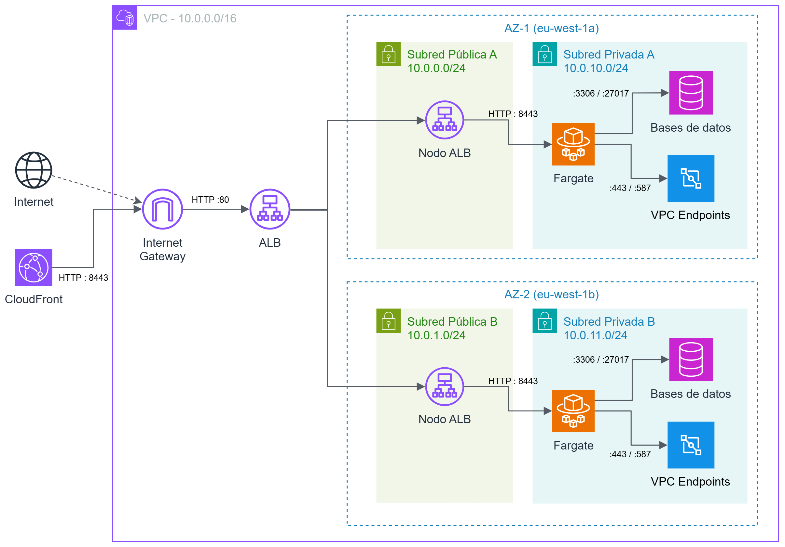
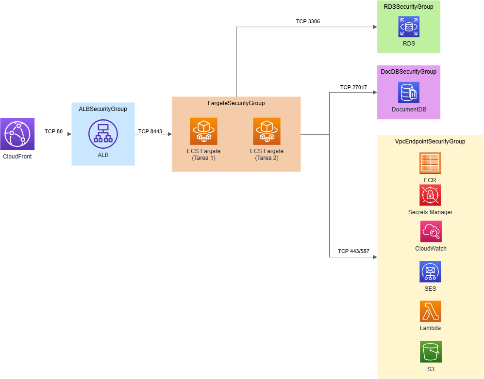
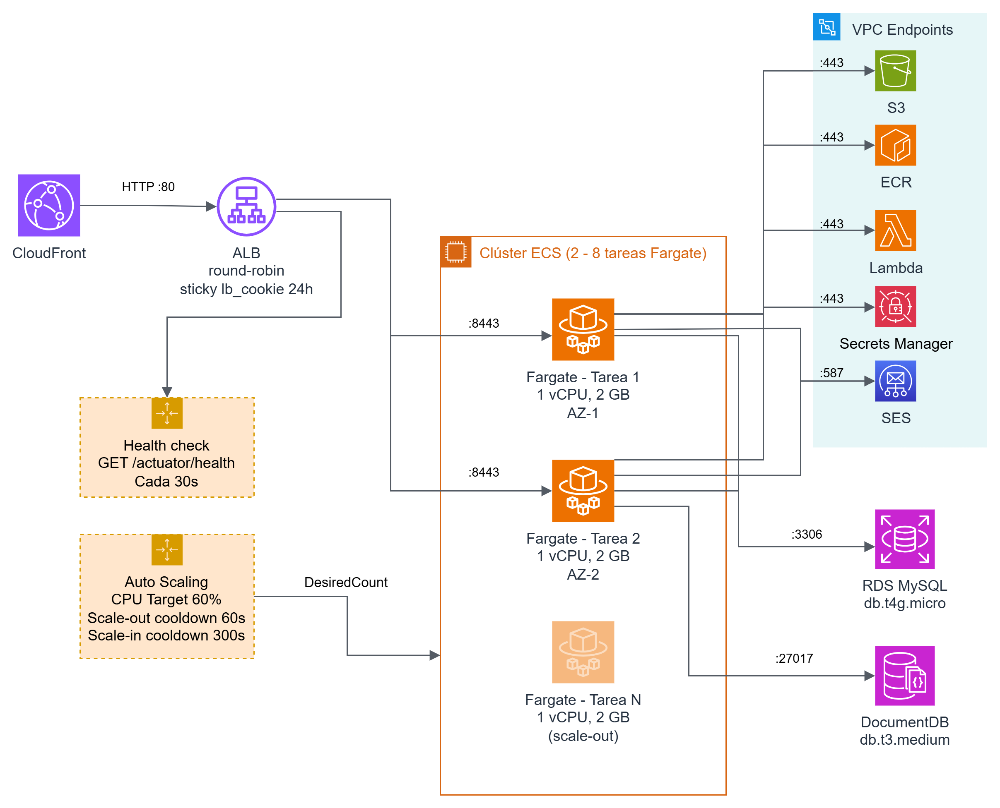

## ☁️ AWS Architecture

### 🔎 Index

1. [Overview](#-overview)
2. [AWS Services Used](#-aws-services-used)
3. [Network & Isolation](#-network--isolation)
4. [Edge & Global Distribution](#-edge--global-distribution)
5. [Compute](#-compute)
6. [Data & Storage](#-data--storage)
7. [Lambda Functions](#-lambda-functions)
8. [Infrastructure as Code](#-infrastructure-as-code)
9. [Security](#-security)

&nbsp;


### 📍 Overview

The application is deployed on **Amazon Web Services (AWS)** following a cloud-native architecture designed for high availability, horizontal scalability, and fully automated delivery. The decoupled client-server application stays the same as the one built in the previous project; in the cloud, it is extended over a private virtual network where each responsibility —compute, storage, databases, security, and traffic distribution— is handled by one or more independent AWS services.

The result is a layered system where no critical component is exposed directly to the outside, and incoming traffic crosses successive control layers before reaching the application core. A key requirement throughout was that the same artifact must still run locally without any external account, keeping development and testing fully autonomous.

> ℹ️ **NOTE:** The deployment workflows, the environment lifecycle management (start / stop / status), and the load-testing setup are described in the [Development Guide](/docs/pages/04-development-guide.md).

&nbsp;


### 📋 AWS Services Used

| Layer | Services |
|:---|:---|
| **Compute** | Amazon ECS Fargate |
| **Load balancing** | Amazon ELB (Application Load Balancer) |
| **Databases** | Amazon RDS (MySQL), Amazon DocumentDB |
| **Storage** | Amazon S3, Amazon ECR |
| **Network & distribution** | Amazon VPC, Amazon CloudFront, Amazon Route 53 |
| **Security** | AWS WAF, AWS IAM, AWS ACM, AWS Secrets Manager |
| **External services** | AWS Lambda, Amazon SES |
| **Monitoring & cost** | Amazon CloudWatch, AWS Budgets |

&nbsp;


### 🌐 Network & Isolation

The foundation of the infrastructure is a **VPC** divided into four subnets across two availability zones:

- **Public subnets:** host the load balancer and are the only entry point for external traffic.
- **Private subnets:** host the application containers and databases, with no direct internet access. Inbound traffic can only come from the load balancer, and outbound traffic is handled through **VPC Endpoints** (so the tasks reach AWS services without leaving the private network).



Traffic between components is governed by **security groups** following the least-privilege principle, so each service only accepts connections from the specific component that needs to reach it (the ALB from CloudFront, the tasks from the ALB, and the databases from the tasks).



&nbsp;


### 🛰️ Edge & Global Distribution

The global distribution layer is composed of **CloudFront**, **Route 53**, and **AWS WAF**. CloudFront acts as the front layer of the whole architecture, receiving every request before forwarding it to the internal load balancer; direct access to the ALB is blocked, forcing all traffic through this layer. Cache behavior is differentiated by content type, disabling caching for the API and WebSocket routes while optimizing delivery of the static frontend content.

**Route 53** maps the public domain to the CloudFront distribution, and **AWS ACM** provisions and renews the SSL certificate automatically.

&nbsp;


### 💻 Compute

The operational core is an **ECS cluster** running the application tasks on **Fargate**, each hosting the unified FRICT container with sensitive environment variables injected directly from Secrets Manager.



The **Application Load Balancer (ALB)** accepts traffic from CloudFront and forwards it to the tasks, performing periodic health checks on `/actuator/health` and using session-affinity cookies so a user's requests always reach the same instance (required for WebSocket connections). Autoscaling is driven by a target tracking policy on average CPU utilization, between a minimum of 2 tasks (for high availability) and a maximum of 8 (to absorb demand peaks).

To deliver notifications across multiple active instances, each task keeps its own DocumentDB change stream open: when any task writes a notification, all of them receive it and each delivers it only to the users connected to that specific task, with no explicit coordination between instances.

IAM roles attached to the tasks follow the least-privilege principle, separating the permissions needed at container startup (pulling images, reading secrets) from those used during runtime (S3, Lambda, SES).

&nbsp;


### 🗄️ Data & Storage

- **Amazon RDS** hosts the MySQL database, replacing the local MySQL container and guaranteeing the persistence of the business data without manual server administration.
- **Amazon DocumentDB** is a managed MongoDB-compatible database that handles usage data, notifications, and real-time connections. Its driver compatibility allowed reusing the existing code with minimal changes, with specific adaptations where DocumentDB diverges from MongoDB.
- **Amazon S3** stores the multimedia assets. Being S3-compatible, the migration from MinIO required no significant code changes.
- **Amazon ECR** acts as the private Docker image registry: on each deployment, the image published to DockerHub is pulled into ECR, from where ECS launches the instances.

All sensitive values (database credentials, JWT signing key, database-encryption key, mail credentials, and Google OAuth client ID) are centralized in **AWS Secrets Manager** and injected into the tasks at startup, never exposed in the source code or the logs.

&nbsp;


### λ Lambda Functions

To keep all components inside private subnets, four **AWS Lambda** functions act as intermediaries between the application and external services, avoiding direct internet access from the Fargate tasks: a geocoding proxy (Nominatim), a routing proxy (OSRM), a Google OAuth token validation proxy, and the DocumentDB auto-stop function. Email delivery is handled through **Amazon SES**, which replaces the external SMTP server of the local environment.

&nbsp;


### 🏗️ Infrastructure as Code

The entire infrastructure is defined as **CloudFormation nested stacks**, organized under a root stack that orchestrates the rest. This separation lets each layer be managed independently, easing both partial updates and a full reproduction of the environment from scratch.

```
infra/cloudformation/
  main.yml      — Root stack orchestrating all nested stacks
  network.yml   — VPC, subnets, security groups, VPC endpoints
  data.yml      — RDS MySQL, DocumentDB, Secrets Manager
  lambda.yml    — Geocoding/Google/OSRM Lambdas, auto-stop Lambda, EventBridge
  compute.yml   — ECS cluster, ALB, task definition, autoscaling
  edge.yml      — CloudFront, Route53
```

&nbsp;


### 🔒 Security

The architecture implements defense in depth across multiple layers:

- **Network isolation:** databases, containers, and storage live in private subnets with no direct internet access, and the ALB only accepts traffic from CloudFront. TLS termination occurs at the edge.
- **Perimeter protection:** **AWS WAF** is integrated with CloudFront as the first line of defense, filtering malicious traffic (SQL injection, XSS, bad inputs, malicious IPs, and brute-force attempts) before it reaches the internal services.
- **Access control & data protection:** **Secrets Manager** stores all sensitive values, **least-privilege IAM roles** govern every internal communication, and there are **no AWS credentials stored in GitHub** (OIDC federation restricted to the specific repository and branch).

&nbsp;

[◀️](/docs/pages/04-development-guide.md) **Page 5. AWS Architecture** [▶️](/docs/pages/06-progress-tracking.md)

[⏪ Return to Index](/README.md)